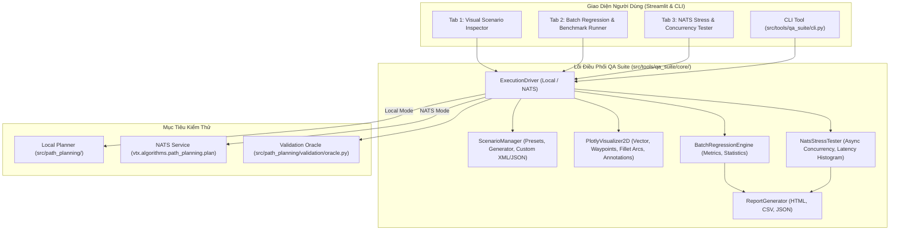

# Thiết Kế Hệ Thống Công Cụ Kiểm Thử Thuật Toán Lập Lịch Đường Bay (VTX QA Suite)

- **Tác giả:** Antigravity Team
- **Ngày:** 31-08-2026
- **Trạng thái:** Bản nháp (Đã thống nhất thiết kế với người dùng)
- **Tài liệu tham chiếu:**
  - `docs/superpowers/specs/2026-08-31-nats-service-redesign.md`
  - `src/path_planning/planner.py`
  - `src/path_planning/validation/oracle.py`
  - `src/service/vtx_service/transport.py`

---

## 1. Bối Cảnh & Mục Tiêu

### 1.1 Bối Cảnh
Hệ thống lập lịch đường bay Kinodynamic A* (`src/path_planning`) và microservice giao tiếp qua NATS Server (`src/service/vtx_service`) đã hoàn thiện các tính năng cốt lõi:
- Đảm bảo các ràng buộc động học: Bán kính quay tối thiểu $R$, góc ngoặt tối đa $\alpha_{\max}$, đoản trình cất cánh $L_0$, đoản trình tiếp cận khóa mục tiêu $DSS$, không va chạm đảo đa giác (Polygon) và chướng ngại vật tròn (Circle).
- Microservice NATS Request-Reply qua Protocol Buffers (`vtx.algorithms.path_planning.plan`) với giới hạn thời gian chạy $5.0\text{s}$.
- Bộ kiểm định độc lập Validation Oracle (`src/path_planning/validation/oracle.py`).

Đội ngũ kiểm thử (QA / QC) và kỹ sư thuật toán cần một **bộ công cụ chuyên dụng (QA Suite)** để:
1. Trực quan hóa và tương tác trực tiếp trên bản đồ 2D.
2. Kiểm tra độc lập tính đúng đắn của quỹ đạo bay và bắt lỗi vi phạm Oracle.
3. Chạy kiểm thử hồi quy hàng loạt (Batch Regression) và xuất báo cáo.
4. Đo tải đồng thời (Concurrency & Stress Testing) cho NATS Microservice.

### 1.2 Mục Tiêu Thiết Kế
- **Đa giao diện (Dual Interfaces):** Cung cấp cả **Web GUI tương tác (Streamlit App)** và **CLI Runner (`tools.qa_cli`)**.
- **Đa phương thức kết nối (Dual Execution Modes):**
  - *Local Mode:* Gọi trực tiếp thư viện Python `path_planning.planner.plan_trajectory`.
  - *NATS Mode:* Gửi bản tin Protocol Buffers qua `NatsClient` tới NATS Server.
- **Thẩm định độc lập 100%:** Mọi kết quả (dù từ Local hay NATS) đều được đưa qua Validation Oracle để kiểm tra tính hợp lệ.
- **Tái hiện lỗi tức thì (One-Click Reproduce):** Cho phép nạp ngay lập tức bất kỳ kịch bản nào bị lỗi trong quá trình chạy batch vào giao diện trực quan để phân tích.

---

## 2. Kiến Trúc Hệ Thống



---

## 3. Thiết Kế Chi Tiết Từng Phân Hệ

### 3.1 Module Điều Phối Thực Thi (`ExecutionDriver`)
- **Vị trí:** `src/tools/qa_suite/core/runner.py`
- **Chức năng:**
  - Nhận đầu vào là cấu hình kịch bản (Scenario hoặc `PlanRequest`).
  - Điều phối gọi:
    - **Local Mode:** Tiền xử lý bằng `prepare_scenario` $\to$ Gọi `plan_trajectory`.
    - **NATS Mode:** Khởi tạo `NatsClient` $\to$ Encode request Protobuf $\to$ Gửi tới subject `vtx.algorithms.path_planning.plan` $\to$ Chờ phản hồi $\to$ Decode `PlanReply`.
  - Chuyển đổi kết quả đầu ra về cấu trúc thống nhất `QAResult`:
    ```python
    @dataclass
    class QAResult:
        scenario_name: str
        status: str  # OK, NO_PATH, TIMEOUT, INVALID_REQUEST, INTERNAL_ERROR
        is_success: bool
        waypoints: list[tuple[tuple[float, float], float]]
        path_length_m: float
        wall_time_s: float
        applied_time_budget_s: float
        iterations: int
        oracle_verdict: ValidationResult
        error_detail: str | None
        raw_response: object
    ```

### 3.2 Module Trực Quan Hóa 2D (`PlotlyVisualizer2D`)
- **Vị trí:** `src/tools/qa_suite/core/visualizer_2d.py`
- **Chức năng:**
  - Tạo biểu đồ Plotly 2D tương tác cao:
    - **Tọa độ & Lưới:** Hệ tọa độ Descartes tính bằng mét ($m$), tự động căn chỉnh khung hình theo kích thước bản đồ.
    - **Điểm đầu & Đích:** Điểm cất cánh $O$ (xanh lá) và mục tiêu $T$ (đỏ) kèm mũi tên chỉ hướng bay.
    - **Chướng ngại vật:**
      - Đảo đa giác (Polygon): Vẽ màu xám/nâu kèm viền buffer $SAFE\_MARGIN$.
      - Vật cản tròn (Circle): Vẽ hình tròn màu cam/đỏ kèm bán kính mở rộng.
      - Vùng an toàn (Safezone): Vẽ viền bao màu xanh lam.
    - **Quỹ đạo bay (Trajectory):**
      - Đoạn thẳng nối các waypoint (nét liền xanh).
      - Cung lượn Fillet Arc bán kính $R$ tại mỗi góc rẽ $W_i$ (màu tím/magenta).
      - Đánh dấu tiếp điểm rời và tiếp điểm vào của cung lượn ($W_{in}, W_{out}$).
      - Nhãn chú thích góc rẽ $\alpha_i$ (độ) và khoảng cách đoản trình $l_i$ ($m$).
    - **Hover Tooltips:** Hiển thị tọa độ $(x, y)$, góc hướng bay $(\text{deg})$, và khoảng cách tới điểm tiếp theo.

### 3.3 Module Kiểm Thử Hàng Loạt & Hồi Quy (`BatchRegressionEngine`)
- **Vị trí:** `src/tools/qa_suite/core/batch_runner.py`
- **Chức năng:**
  - Thực thi danh sách $N$ kịch bản (18 Presets có sẵn hoặc sinh ngẫu nhiên).
  - Thu thập chỉ số thống kê:
    - Tổng số ca test, số ca thành công, số ca thất bại (Success Rate %).
    - Thời gian chạy: Min, Max, Mean, p50, p90, p95, p99 (so sánh với trần 5.0s).
    - Chiều dài đường bay so với Euclidean Lower Bound và Dubins Lower Bound.
    - Tỷ lệ vi phạm Oracle (nếu có).
  - Hỗ trợ lưu trữ kết quả và kích hoạt xem chi tiết từng ca kiểm thử trên UI.

### 3.4 Module Đo Tải Đồng Thời NATS (`NatsStressTester`)
- **Vị trí:** `src/tools/qa_suite/core/stress_tester.py`
- **Chức năng:**
  - Khởi tạo pool gồm $C$ async NATS clients hoạt động đồng thời (asyncio coroutines).
  - Gửi liên tục $M$ requests tới NATS queue group `vtx.algorithms.path_planning`.
  - Đo lường:
    - Throughput (requests/giây).
    - Biểu đồ phân phối độ trễ (Latency Distribution / Histogram).
    - Đếm số lượng lỗi kết nối, lỗi timeout (> 5.0s), lỗi server internal.
    - Đánh giá khả năng cân bằng tải giữa các worker instance.

### 3.5 Module Giao Diện Web Streamlit (`app.py` & `views/`)
- **Vị trí:** `src/tools/qa_suite/app.py`, `src/tools/qa_suite/views/`
- **Cấu trúc Tab:**
  - **Tab 1: Visual Scenario Inspector**
    - Sidebar: Chọn preset / nhập tham số / upload XML, chọn chế độ Local/NATS, nhập tham số xe ($R, \alpha_{\max}, L_0, DSS$).
    - Main Panel: Biểu đồ tương tác Plotly 2D, bảng tóm tắt kết quả (Status, Thời gian, Chiều dài, Iterations), bảng chi tiết thẩm định Oracle (từng đoạn thẳng $l_i$, góc rẽ $\alpha_i$, va chạm).
  - **Tab 2: Batch Regression Runner**
    - Chọn tập kiểm thử: 18 Presets hoặc Sinh ngẫu nhiên $N$ ca test với các Topology khác nhau.
    - Nút bấm "Chạy Kiểm thử" $\to$ Hiển thị Progress Bar $\to$ Xuất thẻ thống kê chỉ số (KPI cards), biểu đồ phân phối thời gian và bảng kết quả chi tiết.
    - Cột hành động: Nút "Inspect" cho từng ca test để mở ngay trên Tab 1.
    - Nút xuất báo cáo: Tải về HTML Report / CSV / JSON.
  - **Tab 3: NATS Concurrency & Stress Tester**
    - Cấu hình: NATS URL, Concurrency level, Total requests, Request timeout.
    - Bấm "Bắt đầu Test Tải" $\to$ Hiển thị đồ thị thời gian thực theo dõi Throughput & Latency.
    - Báo cáo kết quả chịu tải của microservice.

### 3.6 Module Giao Diện Dòng Lệnh (`cli.py`)
- **Vị trí:** `src/tools/qa_suite/cli.py`
- **Các lệnh hỗ trợ:**
  - `python -m tools.qa_suite.cli run-presets [--target local|nats] [--nats-url ...]`
  - `python -m tools.qa_suite.cli batch-random --num-tests 100 [--target local|nats] [--output report.html]`
  - `python -m tools.qa_suite.cli stress-test --concurrency 10 --requests 100 [--nats-url ...]`
  - `python -m tools.qa_suite.cli serve [--port 8501]`

---

## 4. Kế Hoạch Tổ Chức Thư Mục

```
src/
└── tools/
    └── qa_suite/
        ├── __init__.py
        ├── app.py                   # Streamlit Main App
        ├── cli.py                   # CLI Entrypoint
        ├── core/
        │   ├── __init__.py
        │   ├── runner.py            # Execution Driver (Local & NATS)
        │   ├── visualizer_2d.py     # Plotly 2D Interactive Map
        │   ├── batch_runner.py      # Batch Regression Engine
        │   ├── stress_tester.py     # NATS Concurrency Tester
        │   └── report_generator.py  # HTML/CSV/JSON Report Generator
        └── views/
            ├── __init__.py
            ├── tab_inspector.py     # Tab 1 View
            ├── tab_batch.py         # Tab 2 View
            └── tab_stress.py        # Tab 3 View
tests/
└── tools/
    └── unit/
        ├── test_qa_runner.py
        ├── test_batch_runner.py
        ├── test_visualizer_2d.py
        └── test_stress_tester.py
```

---

## 5. Chiến Lược Kiểm Thử QA Suite

1. **Unit Tests:**
   - Kiểm tra `ExecutionDriver` hoạt động chính xác với cả Local mode và Mocked NATS mode.
   - Kiểm tra `BatchRegressionEngine` tổng hợp chỉ số thống kê (p50, p95, success rate) chính xác.
   - Kiểm tra `PlotlyVisualizer2D` sinh figure hợp lệ, đầy đủ các layers (waypoints, arcs, obstacles).
   - Kiểm tra `ReportGenerator` tạo file HTML/CSV hợp lệ.
2. **Integration Verification:**
   - Chạy lệnh CLI `run-presets` trên môi trường thật với toàn bộ 18 presets.
   - Chạy thử nghiệm Streamlit App ở chế độ headless test.
   - Xác thực 100% test pass, 0 lỗi Ruff, 0 lỗi Pyright.
