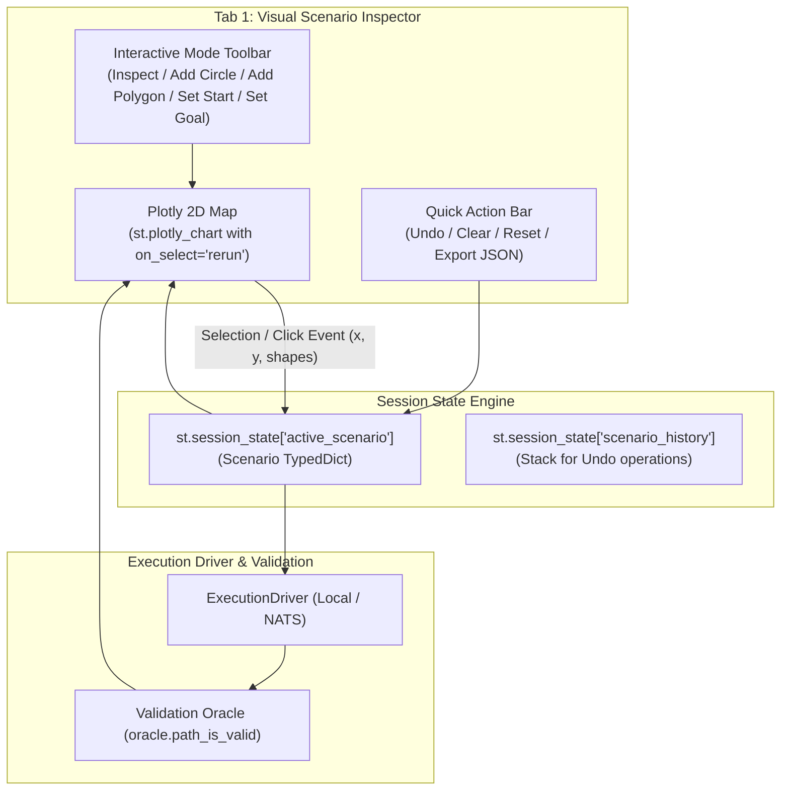

# Thiết Kế Kiến Trúc: Interactive Scenario Studio (VTX QA Suite)

## 1. Tổng quan & Mục tiêu (Overview & Goals)
Tính năng **Interactive Scenario Studio** bổ sung khả năng tạo lập, kéo thả, thêm và xóa chướng ngại vật (tròn & đa giác), cũng như di chuyển điểm xuất phát (Start) và đích đến (Goal) **trực tiếp trên bản đồ 2D tương tác** của Tab 1 (Visual Inspector) mà không cần nhập tọa độ thủ công.

### Mục tiêu chính:
1. **Thao tác đồ họa trực tiếp:** Người dùng có thể click lên bản đồ để tạo chướng ngại vật tròn với bán kính tùy chọn, click nối các đỉnh để tạo đảo đa giác, hoặc click để dời Start/Goal.
2. **Hỗ trợ công cụ vẽ Plotly native:** Kích hoạt các công cụ `drawcircle`, `drawclosedpath`, `eraseshape` trên thanh ModeBar của Plotly với hệ tọa độ Metric Cartesian ($X, Y$) tính bằng mét chuẩn $1:1$.
3. **Đồng bộ trạng thái 2 chiều (Bidirectional State Sync):** Mọi thao tác vẽ trên bản đồ lập tức cập nhật vào `st.session_state` kịch bản hiện hành, có thể bấm *🚀 Run Planning* để kiểm tra quỹ đạo bay ngay lập tức.
4. **Quản lý lịch sử thao tác:** Cung cấp các nút *Undo Last Item*, *Clear All Obstacles*, và *Reset to Default Preset*.

---

## 2. Kiến trúc & Luồng Xử lý Dữ liệu (Architecture & Data Flow)



---

## 3. Chi tiết Thiết kế Thành phần (Component Design)

### A. Core Module Enhancements

#### 1. `src/tools/qa_suite/core/scenario_custom.py`
Bổ sung các hàm helper thao tác trên `Scenario` struct mà không gây đột biến (immutable/pure helpers):
- `add_circle_obstacle(scenario: Scenario, center: tuple[float, float], radius: float) -> Scenario`
- `add_polygon_obstacle(scenario: Scenario, vertices: list[tuple[float, float]]) -> Scenario`
- `remove_last_obstacle(scenario: Scenario) -> Scenario`
- `clear_all_obstacles(scenario: Scenario) -> Scenario`
- `update_start_position(scenario: Scenario, start: tuple[float, float], heading_rad: float | None = None) -> Scenario`
- `update_goal_position(scenario: Scenario, goal: tuple[float, float], heading_rad: float | None = None) -> Scenario`

#### 2. `src/tools/qa_suite/core/visualizer_2d.py`
Cập nhật `PlotlyVisualizer2D.create_scenario_figure()`:
- Thêm cấu hình ModeBar hỗ trợ vẽ hình:
  - `config = {"modeBarButtonsToAdd": ["drawcircle", "drawclosedpath", "drawline", "eraseshape"]}`
  - Cho phép người dùng dùng cả công cụ vẽ của Plotly lẫn công cụ click theo chế độ.
- Vẽ thêm các điểm đỉnh đa giác đang vẽ dở (draft polygon vertices) nếu người dùng đang ở chế độ tạo đa giác.

---

### B. View Module Enhancements (`src/tools/qa_suite/views/tab_inspector.py`)

#### 1. Bộ chọn Chế độ Tương tác (Interactive Mode Selector)
Thêm thanh công cụ radio/pills chọn chế độ:
- 🔍 **Inspect Mode:** Di chuột xem tọa độ, phóng to, thu nhỏ, xoay bản đồ bình thường.
- ⭕ **Quick Add Circle:** Click chuột vào vị trí bất kỳ trên bản đồ $\to$ Tự động tạo 1 chướng ngại vật tròn tại $(x_{click}, y_{click})$ với bán kính $R_{default}$ (có thanh trượt chỉnh trước bán kính từ $5\text{ km} - 50\text{ km}$).
- 📐 **Polygon Vertex Placer:** Click các điểm liên tiếp $\to$ Hiển thị đường nét đứt draft. Khi bấm nút *"Finish Polygon"* $\to$ Tự động đóng góc đa giác và thêm vào danh sách Islands.
- 🟢 **Relocate Start ($O$):** Click vào bản đồ để dời điểm cất cánh đến tọa độ mới.
- 🔴 **Relocate Goal ($T$):** Click vào bản đồ để dời điểm đích đến tọa độ mới.

#### 2. Bắt sự kiện Click / Selection từ Streamlit
Sử dụng cú pháp Streamlit 1.35+:
```python
selection = st.plotly_chart(
    fig,
    use_container_width=True,
    on_select="rerun",
    selection_mode=["points", "box"],
    key="inspector_map",
)
```
- Khi `selection` trả về dữ liệu điểm click `point["x"]`, `point["y"]`, hệ thống xử lý theo chế độ đang chọn và ghi vào `st.session_state["active_scenario"]`.

#### 3. Bảng điều khiển Quản lý Chướng ngại vật (Interactive Obstacles Panel)
- Hiển thị danh sách tóm tắt các vòng tròn và đa giác hiện có.
- Nút **↩️ Undo Last Obstacle**: Hoàn tác vật cản vừa tạo.
- Nút **🗑️ Clear All Obstacles**: Xóa sạch toàn bộ vật cản (trở thành open ocean).
- Nút **🔄 Reset to Preset**: Khôi phục về kịch bản chuẩn ban đầu.

---

## 4. Kế hoạch Kiểm thử & Đảm bảo Chất lượng (Testing & QA)
1. **Unit Tests (`tests/tools/unit/test_scenario_custom.py`):**
   - Kiểm thử `add_circle_obstacle`, `add_polygon_obstacle`, `remove_last_obstacle`, `update_start_position`, `update_goal_position`.
   - Kiểm thử tính bất biến (immutability) và tính hợp lệ của `Scenario` dict trả về.
2. **View & Event Tests (`tests/tools/unit/test_views.py`):**
   - Kiểm thử render view khi chuyển đổi qua lại giữa các chế độ tương tác.
   - Kiểm thử xử lý sự kiện click giả lập từ Plotly selection payload.
3. **Static Analysis & Linting:**
   - Đảm bảo `ruff check .`, `ruff format .`, `pyright` đều đạt 100% không lỗi.
   - Chạy toàn bộ test suite `pytest tests/ -v` (240+ tests pass).
